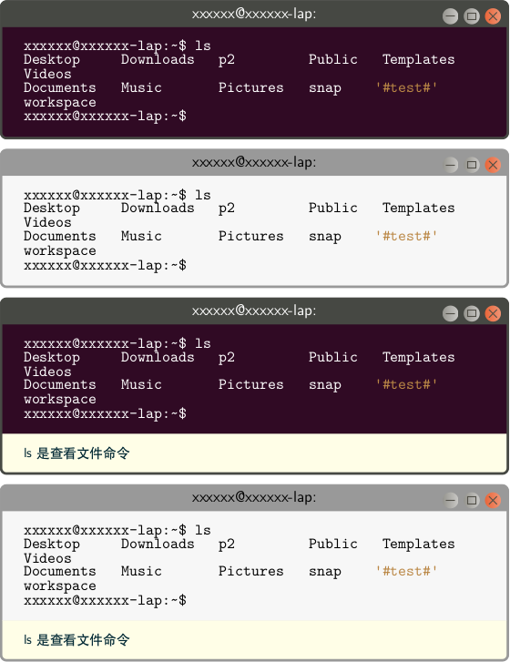
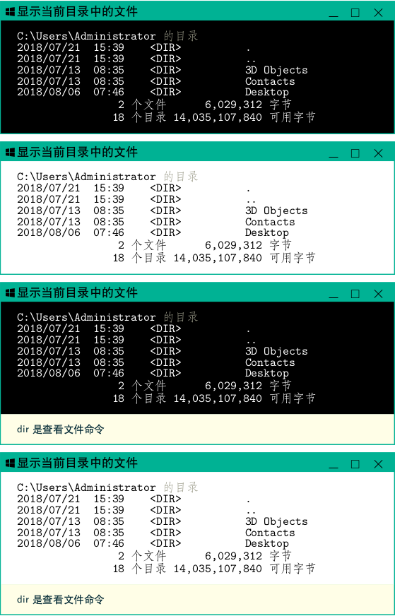
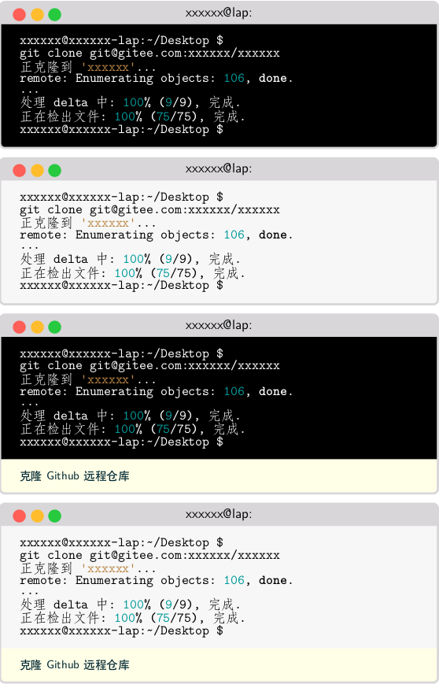
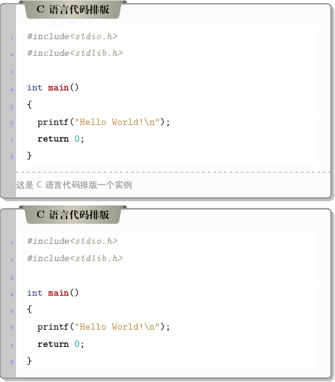
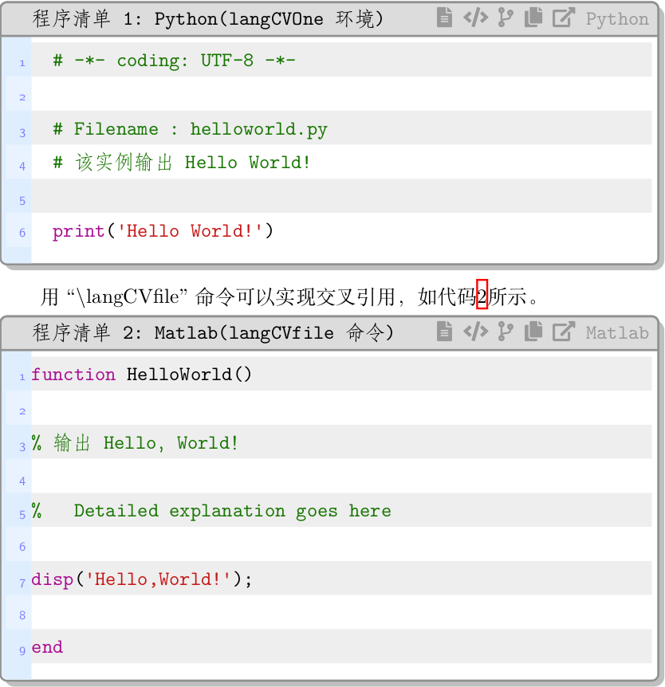

# boxie.sty

#### 项目介绍
这是一个从"https://github.com/latexstudio/ChenLaTeXBookTemplate"中提取出来的基于tcolorbox宏包和minted 宏包或listings宏包排版代码的宏包。另外，结合原代码中的排版Ubuntu终端窗口的代码，我进一步完善了用于排版Ubuntu、Mac、Windows终端窗口的环境和从文件中加载终端窗口内容的排版命令。

可以用：\usepackage{boxie}加载该宏包。

#### 软件架构
1. 采用LaTeX撰写，需要ctex宏包支持中文、minted宏包支持代码编排。
2. 需要webfonts5.0图标字体支持。
3. 需要将“vextra.sty”和“lstlinebgrd.sty”放在与"boxie.sty"同一个目录下。

#### 排版样例
1. Ubuntu终端窗口

2. Windows命令行窗口

3. Mac终端窗口

4. 无交叉引用代码盒子

5. 有交叉引用代码盒子

#### 安装教程

1. 需要安装TexLive2018的跨平台LaTeX发行版。
2. 可以使用除Windows记事本外的任何文本编辑器编辑LaTeX代码。
3. 需要安装Python及其Pygments模块以支持minted宏包。
4. 需要安装webfonts5.0图标字体，若使用Ubuntu，直接将所有字体文件拷贝到用户目录的“.font”文件夹中，然后在该文件来中执行
	sudo mkfontscale(创建字体的fonts.scale文件，它用来控制字体旋转/缩放)
	sudo mkfontdir (创建字体的fonts.dir文件，它用来控制字体粗斜体产生)
	sudo fc-cache -fv (建立字体缓存信息，也就是让系统认识字体)

###更新内容
1. 12个终端窗口环境
   ubtdarkc、windarkc和macdarkc环境带有两个参数，用于排版带有底部说明的黑底白字终端窗口，第一个参数是底部说明文字，第二个参数是标题。
   ubtlightc、winlightc和maclightc环境带有两个参数，用于排版带有底部说明的白底黑字终端窗口，第一个参数是底部说明文字，第二个参数是标题。
   如：
   \begin{ubtdarkc}{底部说明}{标题}
   ...
   \end{ubtdarkc}
   ubtdark、windark和macdark环境带有一个参数，用于排版黑底白字终端窗口，参数是标题。
   ubtlight、winlight和maclight环境带有一个参数，用于排版白底黑字终端窗口，参数是标题。
   如：
   \begin{ubtdark}{标题}
   ...
   \end{ubtdark}
2. 12个终端窗口排版命令
   带底部说明黑底白字：
   \ubtdarkcfile{底部说明}{标题}{窗口内容文件名}
   \windarkcfile{底部说明}{标题}{窗口内容文件名} 
   \macdarkcfile{底部说明}{标题}{窗口内容文件名} 
   带底部说明白底黑字：
   \ubtlightcfile{底部说明}{标题}{窗口内容文件名}
   \winlightcfile{底部说明}{标题}{窗口内容文件名} 
   \maclightcfile{底部说明}{标题}{窗口内容文件名} 
   黑底白字：
   \ubtdarkfile{标题}{窗口内容文件名}
   \windarkfile{标题}{窗口内容文件名} 
   \macdarkfile{标题}{窗口内容文件名} 
   白底黑字：
   \ubtlightfile{标题}{窗口内容文件名}
   \winlightfile{标题}{窗口内容文件名} 
   \maclightfile{标题}{窗口内容文件名} 
3. 2个通用Ubuntu样式终端窗口环境，可以指定窗口内容代码语言
   \begin{GitExample}[代码语言]{底部说明}{标题}
     ...
   \end{GitExample} 
   和
   \begin{GitExampla}[代码语言]{标题}
     ...
   \end{GitExampla} 
4. 1个通用Ubuntu终端窗口排版命令，直接通过导入窗口内容，可以指定内容代码语言
   \gitfile[代码语言]{标题}{文件名}
5. 2个不需要编号的通用代码排版环境，可以指定代码语言和底部说明
   \begin{langPyTwo}[代码语言]{底部说明}{标题}
     ...
   \end{langPyTwo} 
   和
   \begin{langPyOne}[代码语言]{标题}
     ...
   \end{langPyOne} 
6. 1个可以编号的通用代码排版环境，可以指定代码语言和底部说明
   \begin{langCVOne}[代码语言][交叉引用标签][显示语言名]{标题}
     ...
   \end{langCVOne} 
7. 1个可以编号的通用代码排版命令，直接通过导入代码文件来排版代码

   \langCVfile[代码语言][交叉引用标签][语言名显示]{标题}{文件名}
8. 1个不带编号的通用代码排版命令，直接通过导入代码文件来排版代码

   \langPyfile[代码语言]{标题}{文件名}

其中，中括号的参数的可选的。

#### 使用说明

1. LaTeX的编译命令是：xelatex -shell-escape -interaction=nonstopmode，其中-shell-escape是使用minted宏包需要的参数。
2. 如果LaTeX编译时无--shell-escape参数，则使用listings排版代码。
3. 既可以在各类IDE中执行编译，可以在当前目录的命令行执行：make 命令进行编译
4. 在当前目录的命令行执行：make clean可以清理中间过程文件
5. 编译结果是PDF文件，请使用合适的软件进行查看。

#### 参与贡献

1. 本项目由西北农林科技大学信息工程学院耿楠创建和维护
2. 如果您愿意一同参与工作(不计报酬，免费自由)，请及时与作者联系
